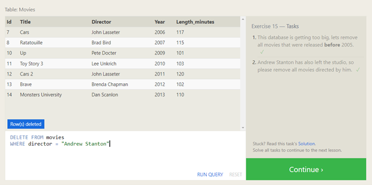

# SQL: Prework

## Basics

SQL, or Structured Query Language, is a language designed to allow both technical and non-technical users query, manipulate, and transform data from a relational database. And due to its simplicity, SQL databases provide safe and scalable storage for millions of websites and mobile applications.

## Basic Queries

SELECT - Used for reading/retrieving rows and columns from database tables

INSERT - Used for creating rows on existing tables

UPDATE - Used for updating rows on existing tables

DELETE - Used for deleting rows from an existing table

Exercises

 

 

 

 

 

 

 

 

 

 

 

>References
>
>[sql bolt](https://sqlbolt.com/)